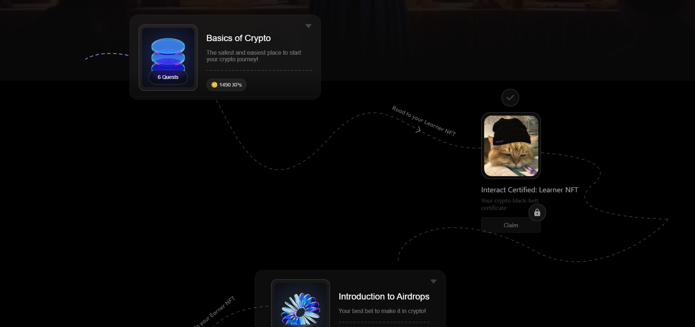
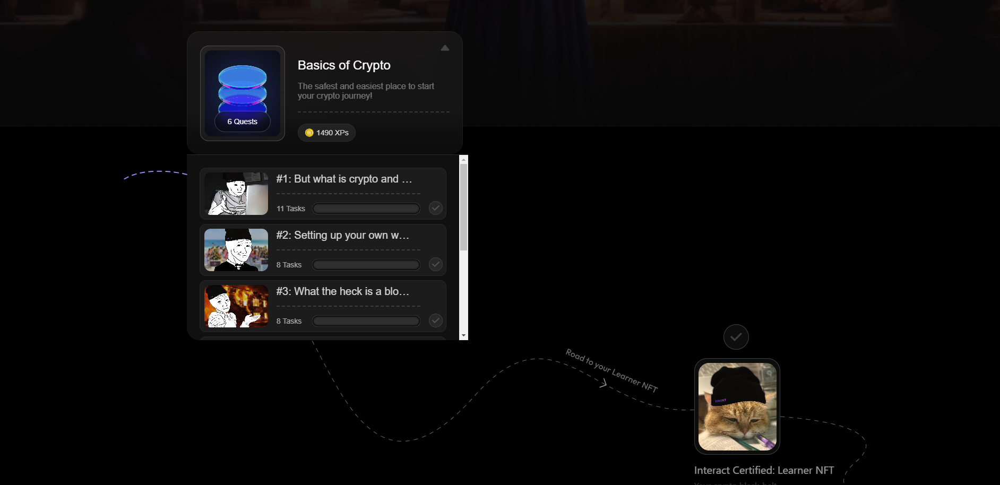
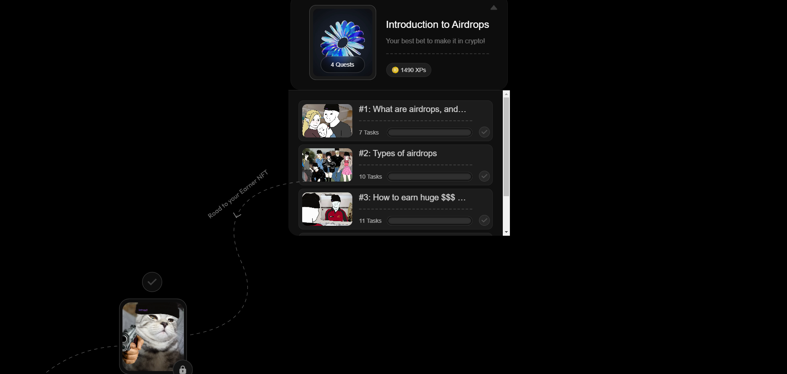
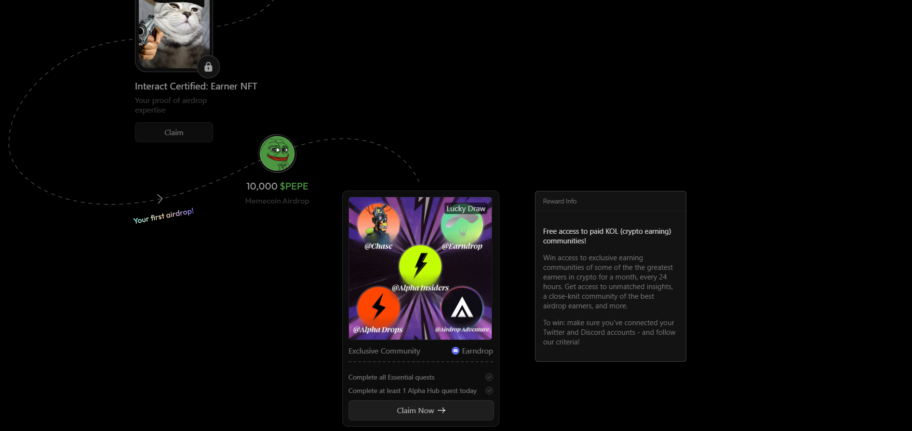
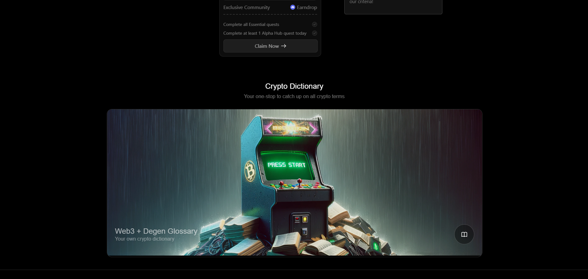
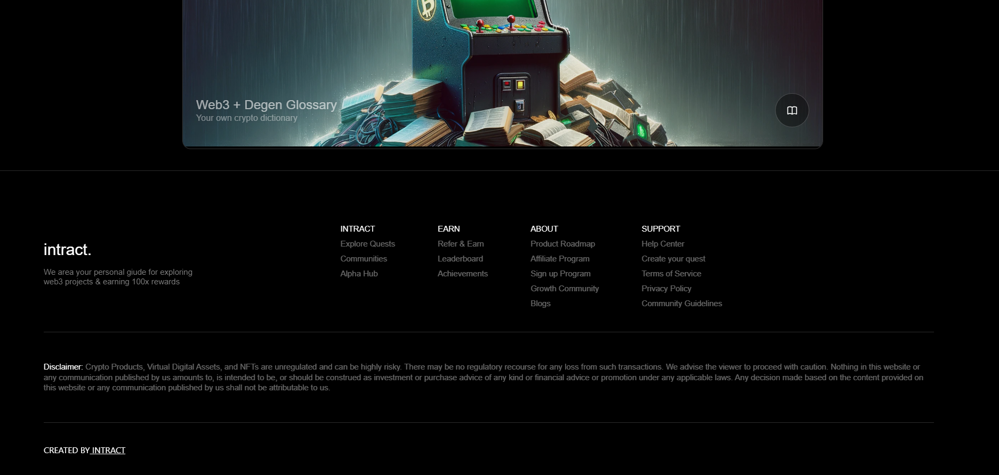

## Installation

````
2. Install the necessary dependencies:
```bash
npm install
````

3. Start the server

```bash
npm start
```

Access the application via http://localhost:3000.

## Technologies Used

`ReactJS`,
